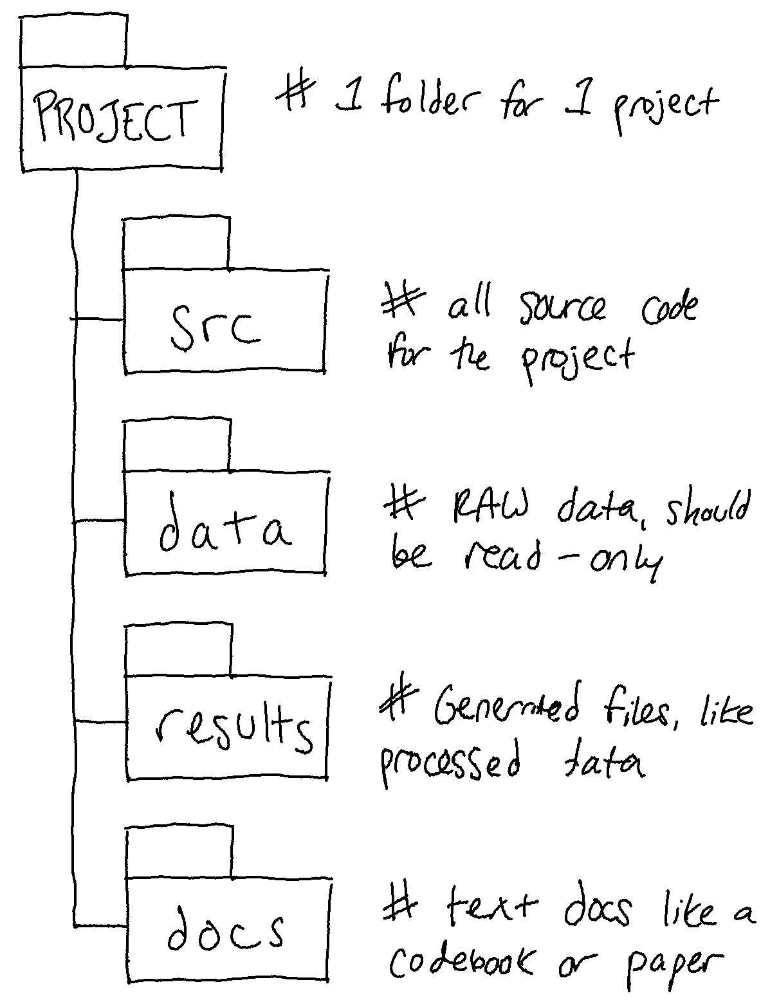

# A computational approach {-#lis-comp}

To start this lesson, let's first ask: why take an automated or computational approach?

This is otherwise known as the 'why not do it manually?' question. There are plenty of times when manual work is the easiest, fastest, and most efficient approach. Here are two conditions that should make you consider using automation:

1. You know how to automate the task.
2. You think this is a task you will do over and over again.

Automation refers to a process or procedure that runs with little to no supervision or action. Libraries have been automating workflows for years and many the Library Carpentry lessons can help people in libraries consider and implement automation approaches to further those efforts. You may often receive reports that you have to manually format or bibliographies where you have to clean metadata.

Some motivations and takeaways:

* *Automate to make the time to do something else*! Taking the time to gather together even the most simple programming skills can save time to do more interesting stuff! (even if often that more interesting stuff is learning more programming skills...)
* Consider the role of programming in professional development. *Computational skills improve your efficiency and effectiveness*. Stay alert to skills you want to learn, and be aware of what skills you can make sure your staff learn, as well.
* *Knowing (even a little) code helps you* evaluate projects that use code. Programming can seem unknowable. Getting to run some code can empower you to dive in, start small, and ramp up!

**Discussion break**

Is there something you would like to automate in your work?

## Names Matter {-}

So let's set ourselves up well to be able to automate our tasks.  We are all guilty of naming our files in such a way that sometimes we have a hard time finding them, and that means that it'll be harder for us to work with them in an automated fashion. The following XKCD comic may be all too familiar:

There are a number of other [less than ideal file naming examples](http://20px.com/blog/2015/07/16/catalogue-bad-file-naming/) cataloged by Twenty Pixels. Do any of these examples look familiar?

Some best practices include:

+ Prefix your files with the date created using a `YYYY-MM-DD` format
+ Avoid special characters like `&`, `%`, `$`, `#`, `@`, and `*`. Just use letters and numbers.
+ Do not make file identity dependent on capitalization unless implementing camel case (e.g. `fileName.xml`).
+ Never use spaces in file names -- many systems and software will not recognize them or will give errors unless such filenames are treated specially. Use an underscore `_` or a dash `-` instead of a space.
+ Use short file names. For your sake and the sake of systems that'll fail if you give it like a 50 character file name.

**Naming files sensible things is good for you and for your computers**

Working with data is made easier by structuring your files in a consistent and predictable manner. Without structured information, our lives would be much poorer. As library and archive people, we know this. But let’s linger on this a little longer because for working with data it is especially important.

Examining URLs is a good way of thinking about why structuring data in a consistent and predictable manner might be useful in your work. Good URLs represent with clarity the content of the page they identify, either by containing semantic elements or by using a single data element found across a set or majority of pages.

A typical example of the former are the URLs used by news websites or blogging services. WordPress URLs follow the format:

`ROOT/YYYY/MM/DD/words-of-title-separated-by-hyphens`

[https://cradledincaricature.com/2015/07/24/code-control-and-making-the-argument-in-the-humanities/](https://cradledincaricature.com/2015/07/24/code-control-and-making-the-argument-in-the-humanities/)

A similar style is used by news agencies such as a The Guardian newspaper:

`ROOT/SUB_ROOT/YYYY/MMM/DD/words-describing-content-separated-by-hyphens`

[https://www.theguardian.com/uk-news/2014/feb/20/rebekah-brooks-rupert-murdoch-phone-hacking-trial](https://www.theguardian.com/uk-news/2014/feb/20/rebekah-brooks-rupert-murdoch-phone-hacking-trial)

In data repositories, URLs structured by a single data element are often used. The National Library of Australia’s TROVE uses this format:

`ROOT/record-type/REF`

[https://trove.nla.gov.au/work/6315568](https://trove.nla.gov.au/work/6315568)

The Old Bailey Online uses the format:

`ROOT/browse.jsp?ref=REF`

[https://www.oldbaileyonline.org/browse.jsp?ref=OA16780417](https://www.oldbaileyonline.org/browse.jsp?ref=OA16780417)

What we learn from these examples is that a combination of semantic description and data elements make for consistent and predictable naming structures that are readable both by humans and machines. Transferring this kind of pattern to your own files makes it easier to browse, to search, and to query using both the standard tools provided by operating systems and by the more advanced tools that we'll cover in these next days together. When we know what things look like, we can match on patterns and be able to automate quite a lot. We'll look at pattern matching next!

In practice, it's also useful then to keep a standard way of organizing your projects alongside your file naming conventions, to help us avoid falling down the nested folder rabbit hole. This way of organizing projects I've found is one of the most helpful:

+ Put each `project` in its own directory, which is named after the project and perhaps prepended with that `YYYY-MM-DD` of when the project started.
     - if this is a more general file structure, I tend to have a `CurrentWork` directory and a `Documents` directory to separate out the files I am keeping because I'll refer to them again and the files I'm working on the most.
+ A series of sub-directories such as `docs`, `data`, `metadata`, `events`, etc. depending on what you are working on.
+ Within those directories, keep your naming convention!

The name of a file is important to ensuring it and its contents are easy to identify. `Data.csv` doesn't fulfill this purpose. A title that describes the data does. And adding dating convention to the file name, associating derived data with base data through file names, and using directory structures to aid comprehension strengthens those connections.

## Picking open formats {-}

Otherwise known as, **plain text formats are your friend**. Why? Because computers can process them!

If you want computers to be able to process your stuff automatically, try to get in the habit where possible of using software-agnostic formats such as `.csv` (comma-separated values) or `.tsv` (tab-separated values) for tabular data/spreadsheets. 

These plain text formats are preferable to the proprietary formats (e.g., Microsoft Word or Excel) because they can be opened by many software packages -- so they don't make you rely on/have to pay for software to view your work! This is much more sustainable nad increases the chances of keeping the files viewable and editable in the future. Most standard office suites include the option to save files in `.txt`, `.csv`, and `.tsv` formats, meaning you can continue to work with familiar software and save your files in the more perennial formats. Compared to `.docx` or `.xlsx`, these formats have the additional benefit of containing only **machine-readable elements**.

For instance, when we license data for text mining, we collect it in plain formats like `.txt` or `.xml` so that researchers who come to us to use this data can use it with their analysis scripts which might do things like automate looking for entities or keywords in large amounts of text. In Library Carpentry: The UNIX Shell lesson that we'll do this afternoon with Andrew, we all see how the command line can be a powerful tool for working with text files.

Word processors like Microsoft Word, LibreOffice Writer, and Google Docs will explicitly not work for this purpose – those tools are meant to optimize how documents appear to humans, not to computers. They add many hidden characters and generally are unsuitable for working with plain text files. The category of tool you’ll want to use to get around that is called `a text editor`. Text editors save only the text that you type – there is no hidden formatting or metadata. What you see in a text editor is what a computer will see when it tries to process that data.

This is what it looks like when you open a Word doc in a plain text editor:

But this is what it looks like when you open a plain text file in a Word processor (in this case, LibreOffice Writer):

So when working with files for automation or computational purposes, it is more important to focus on meaningful transmission of data as opposed to formatting. However, there are plain files that can be rendered very fancifully while also staying plain-text! One example of this is `Markdown`. These materials are written in Markdown, in fact! A special kind, called RMarkdown, but still just plain Markdown :)

Markdown files, which use the file extension `.md`, are machine and human readable. Markdown applications can be disparate, from simple to-do lists, to extensive manual pages. For example, GitHub renders text via Markdown. For instance, you can inspect the [underlying Markdown for this lesson](https://github.com/NYU-DataServices/lc-data-intro/blob/main/01-comp.Rmd)! You can even do things like convert a `.csv` table to a `.md` table, using a helpful resources such as [Convert CSV to Markdown](http://www.convertcsv.com/csv-to-markdown.htm).

The [Markdown Guide](https://www.markdownguide.org/) is a helpful resource for learning Markdown but you can also try:

* [CommonMark's guide](https://commonmark.org/help/)
* [Mastering Markdown](https://guides.github.com/features/mastering-markdown/)
* [Markdown Here Cheatsheet](https://github.com/adam-p/markdown-here/wiki/Markdown-Here-Cheatsheet)

## Summary {-}

* File directory structures should be consistent and predictable.
* Apply naming conventions to directories and file names to identify them, to create associations between data elements, and to assist with the long term readability and comprehension.
* If you're interested in automation, then plain-text files are the best to use because they were made for computer-reading. 

## Further Reading {-}

Burton, M., Lyon, L., Erdmann, C., & Tijerina, B. (2018). "[Shifting to data savvy: the future of data science in libraries](https://d-scholarship.pitt.edu/33891/)."

de la Cruz, J., & Hogan, J. (2016). "['Hello, World!': Starting a Coding Group for Librarians](https://www.semanticscholar.org/paper/%E2%80%9CHello%2C-World!%E2%80%9D%3A-Starting-a-Coding-Group-for-Cruz-Hogan/8d30476f321d7a0662446484fa62a5b86014abfb)." Public Services Quarterly, 12(3), 249-256.

Ovadia, Steven. "[Markdown For Librarians And Academics](https://academicworks.cuny.edu/cgi/viewcontent.cgi?article=1006&context=lg_pubs)." Behavioral & Social Sciences Librarian 33.2 (2014): 120-124.

Rosati, D. A. (2016). "[Librarians and Computer Programming: understanding the role of programming within the profession of librarianship](https://www.semanticscholar.org/paper/Librarians-and-Computer-Programming%3A-Understanding-Rosati/4660ec96867e3b7b93e9248c1b69b9d4e482f13f)". Dalhousie Journal of Interdisciplinary Management, 12(1).

Yelton, A. (2015). "[Coding for Librarians: Learning by Example](https://doi.org/10.5860/ltr.51n3)." American Library Association.