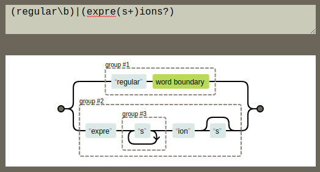

# Regular Expressions {-#regex}

Regular expressions (called `regex` for short) are a way to use patterns to find text. They are an incredibly powerful tool that can amplify your capacity to find, manage, and transform files. You can think of regex as a more complex "find and replac" operation. In a computational setting, we'll refer to the text as a `string`, which is a contiguous sequence of symbols or values. For example, a word, a date, a set of numbers (e.g., a phone number), or an alphanumeric value (e.g., an identifier). A string could be any length, ranging from empty (zero characters) to one that spans many lines of text (including line break characters). You can use regex with pretty much every programming language, and even from within applications like OpenRefine and Google Sheets!

In library searches, we are most familiar with a small part of regular expressions known as the "wild card character" (`*`), but there are many more features to the complete regular expressions syntax. Regular expressions will let you:

+ Match on types of characters (e.g. 'upper case letters', 'digits', 'spaces', etc.).
+ Match patterns that repeat any number of times (e.g. phone numbers, or addresses).
+ Capture the parts of the original string that match your pattern (e.g. get the year from a birthday).

Regular expressions rely on the use of literal characters (like the word "hello") and metacharacters. A `metacharacter` is any American Standard Code for Information Interchange (ASCII) character that has a special meaning. By using metacharacters and possibly literal characters, you can construct a regex for finding strings or files that match a pattern rather than a specific string. 

For example, say you wants to change the way that our office telephone numbers on are displayed on the website by removing the parentheses around the area code. Rather than search for each specific phone number (that could take forever and be prone to error) or searching for every open parenthesis character (could also take forever and return many false-positives), you could search for the pattern of a phone number and do bulk transformations! Save yourself all the time!!

Since regular expressions defines some ASCII characters as "metacharacters" that have more than their literal meaning, it is also important to be able to "escape" these metacharacters to use them for their literal meaning. For example, the period `.` means "match any character", but if you want to match an actual period like at the end of a sentence then you will need to use a `\` in front of it to signal that you want to use the period as a plain old period and not a metacharacter meaning "match any character."

A very simple use of a regular expression would be to locate the same word spelled two different ways. For example the regular expression `organi[sz]e` matches both `organise` and `organize`. But because it locates all matches for the pattern in the file, not just for that word, it would also match `reorganise`, `reorganize`, `organises`, `organizes`, `organised`, `organized`, etc.

## Learning common regex metacharacters {-}

Regular expressions tend to be easier to write than they are to read. This is less of a problem if you are the only one who ever needs to maintain the program, but if several people need to watch over it, the syntax can turn into more of a hindrance than an aid. I always make sure to: a) keep a cheatsheet on hand if I ever need to look at a regex, and b) document what my regex is trying to do in a notes document or README file associated with the work I am using regex for. Here are the common regex metacharacters and some norms.

Square brackets can be used to define a list or range of characters to be found. So:

- `[ABC]` matches A or B or C.
- `[A-Z]` matches any upper case letter.
- `[A-Za-z]` matches any upper or lower case letter.
- `[A-Za-z0-9]` matches any upper or lower case letter or any digit.

Note that regex are case sensitive! `A` will not match `a`. There are other metacharacters that help us match:

- `.` matches any character.
- `\d` matches any single digit.
- `\w` matches any part of word character (equivalent to `[A-Za-z0-9]`).
- `\s` matches any space, tab, or newline.
- `\` used to escape the following character when that character is a special character. So, for example, a regular expression that found `.com` would be `\.com` because `.` is a special character that matches any character.
- `^` is an "anchor" which asserts the position at the start of the line. So what you put after the caret will only match if they are the first characters of a line. The caret is also known as a circumflex.
- `$` is an "anchor" which asserts the position at the end of the line. So what you put before it will only match if they are the last characters of a line.
- `\b` asserts that the pattern must match at a word boundary. Putting this either side of a word stops the regular expression matching longer variants of words. So:
	- the regular expression `mark` will match not only `mark` but also find `marking`, `market`, `unremarkable`, and so on.
	- the regular expression `\bword` will match `word`, `wordless`, and `wordlessly`.
	- the regular expression `comb\b` will match `comb` and `honeycomb` but not `combine`.
	- the regular expression `\brespect\b` will match `respect` but not `respectable` or `disrespectful`.

Other useful special characters are:

- `*` matches the preceding element zero or more times. For example, `ab*c` matches "ac", "abc", "abbbc", etc.
- `+` matches the preceding element one or more times. For example, `ab+c` matches "abc", "abbbc" but not "ac".
- `?` matches when the preceding character appears zero or one time.
- `{VALUE}` matches the preceding character the number of times defined by VALUE; ranges, say, 1-6, can be specified with the syntax `{VALUE,VALUE}`, e.g. `\d{1,9}` will match any number between one and nine digits in length.
- `|` means **or**.
- `/i` renders an expression case-insensitive (equivalent to `[A-Za-z]`).

So we can use these all in combination with each other to find text that matches our patterns. For example, when using a pattern `text?.*`, it will find files like:

* `textf.txt`
* `text1.asp`
* `text9.html`

### Group Challenges {-}

To embed this knowledge we won't - however - be using computers. Instead we'll use pen and paper for now.

Let's try out these exercises as a larger group using the cheatsheet I've given you above to be create regular expressions that answer these questions. I'll call out the question, I'll give you all some time, and whoever wants to either chat out an answer or walk us through their answer on audio would be welcome to!

1. What will the regular expression `^[Oo]rgani.e\b` match?

2. What will the regular expression `^[Oo]rgani.e\w*` match?

3. What will the regular expression `[Oo]rgani.e\w+$` match?

4. What will the regular expression `^[Oo]rgani.e\w?\b` match?

5. What will the regular expression `^[Oo]rgani.e\w?$` match?

6. What will the regular expression `\b[Oo]rgani.e\w{2}\b` match?

7. What will the regular expression `\b[Oo]rgani.e\b|\b[Oo]rgani.e\w{1}\b` match?

This logic is useful when you have lots of files in a directory, when those files have logical file names, and when you want to isolate a selection of files. It can be used for looking at cells in spreadsheets for certain values, or for extracting some data from a column of a spreadsheet to make new columns. There are many other contexts in which regex is useful when using a computer to search through a document, spreadsheet, or file structure. Some real-world use cases for regex are included on an [ACRL Tech Connect blog](https://acrl.ala.org/techconnect/post/fear-no-longer-regular-expressions/).

### Breakout Challenge {-}

You will be put in teams of four to six to get the answers for the exercises below. If you want to check your logic use [regex101](https://regex101.com/), [myregexp](http://myregexp.com/), [regex pal](http://www.regexpal.com/) or [regexper.com](http://regexper.com/). The first three help you see what text your regular expression will match, the latter visualizes the workflow of a regular expression.

1. What will the regular expression `Fr[ea]nc[eh]` match?

2. What will the regular expression `Fr[ea]nc[eh]$` match?

3. What would match the strings `French` and `France` that appear at the beginning of a line?
 
4. How do you match the whole words `colour` and `color` (case insensitive)?

5. How would you find the whole word `headrest` and or `head rest` but not `head  rest` (that is, with two spaces between head and rest?

6. How would you find a string that ends with four letters preceded by at least one zero?

7. How do you match any four-digit string anywhere?

8. How would you match the date format `dd-MM-yyyy`?

9. How would you match the date format `dd-MM-yyyy` or `dd-MM-yy` at the end of a line only?

10. How would you match publication formats such as `British Library : London, 2015 and Manchester University Press: Manchester, 1999`?

## Matching & Extracting Strings {-#regex-match-extract}

We'll do this last set of exercises together as a large group again. For this exercise, open a browser and go to https://regex101.com. Regex101.com is a free regular expression debugger with real time explanation, error detection, and highlighting. It will help us go through the following exercises to do some more complex tasks with regular expressions.

Open the [swcCoC.md](https://github.com/NYU-DataServices/lc-data-intro/blob/main/swcCoC.md) file, copy the text, and paste that into the test string box.

For a quick test to see if it’s working, type the string `community` into the regular expression box.

If you look in the box on the right of the screen, you see that the expression matches six instances of the string `community` (the instances are also highlighted within the text).

I'll call out the question, I'll give you all some time, and whoever wants to either chat out an answer or walk us through their answer on audio would be welcome to!

1. Type `community `. You get three matches. Why not six?

2. If you want to match `community-led` by adding other regex characters to the expression community, what would they be?

3. Change the expression to `communi` and you get 15 full matches of several words. Why?

4. Type the expression` [Cc]ommuni`. You get 16 matches. Why?

5. Type the expression `^[Cc]ommuni`. You get no matches. Why?

6. Find all of the words starting with `Comm` or `comm` that are plural.

9. Let's look at phone numbers: three digits, a dash, and four digits. How would we write a regex expression that matches this?

10. How would we expand the expression above to include an area code (three digits and a dash)?

11. How would we expand the expression above to include a phone number with an area code in parenthesis, separated from the phone number, with or without a space?

12. Country codes are preceded by a `+` and can have up to three digits. We also have to consider that there may or may not be a space between the country code and anything appearing next. How can we expand our phone number regex to include that?

One of the reasons we stress the value of consistent and predictable directory and filenaming conventions is that working in this way enables you to use the computer to select files based on the characteristics of their file names. For example, if you have a bunch of files where the first four digits are the year and you only want to do something with files from `2017`, then you can using regex! Or if you have `journal` somewhere in a filename when you have data about journals, you can use regex to select just those files. Equally, using plain text formats means that you can go further and select files or elements of files based on characteristics of the data within those files.

## Regex in Google Sheets {-}

For our last exercise, I thought we would do one example of how to use regex in an application we probably all work in: Google Sheets! Google Sheets has a function called `REGEXEXTRACT` which takes as the first argument a string and a quoted regular expression in the second, like so: `=REGEXEXTRACT(G2, "[\w.-]+@")`

So let's make a new column based on an old column in Google Sheets, using regex! Do this individually and we'll come back and share strategies as a larger group.

1. Open this Google Sheet with your NYU account: https://docs.google.com/spreadsheets/d/19GNBt_-2EQUKpUnt1T6RbRrAn13XyIIV2Cm7w88W_M0/edit?usp=sharing

2. Click `File > Make a copy`, and make a copy of it in your NYU Google Drive.

3. Look in the `ADDRESS` column and notice that the values contain the latitude and longitude in parenthesis after the library address.

4. Construct a regular expression to match and extract the latitude and longitude into a new column named `latlong`.

## Summary {-}

Please fill in this: https://forms.gle/kCA6zx4UY6zvB5EJ8.

* Regular expressions are used for pattern matching and can be used in many technologies, tools, and programming languages.
* Regular expressions are useful for searching and transforming data.

## Further Resources {-}

Test yourself with [RegexCrossword.com/](https://regexcrossword.com/) or via the extra quizzes provided by Library Carpentries: https://librarycarpentry.org/lc-data-intro/03-quiz/index.html. 